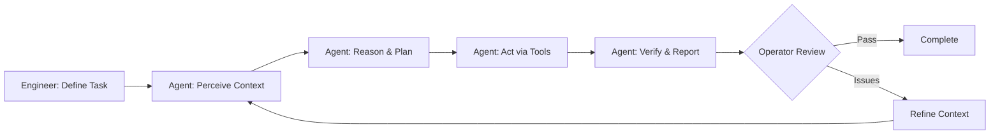

# What Are AI Agents?

Now that you understand the First Principles - what LLMs are and the basic machinery - let's explore what AI agents are, how they execute autonomously, and what your role as an operator entails.

## Learning Objectives

By the end of this lesson, you will:

- Understand what AI agents are and how they differ from traditional coding assistants
- Recognize the engineer-operator mental model for working with agents
- Learn the four-step agent execution workflow (Perceive → Reason → Act → Verify)
- Understand how architecture enables reliable autonomous execution
- Know when agents should ask questions vs. execute autonomously
- Identify when to intervene during agent operation

## What Are AI Agents?

AI agents are **autonomous systems** that execute complete workflows with minimal human intervention. Unlike autocomplete tools or chat assistants, agents combine:

- **Context gathering** - Read files, search code, analyze documentation using tools (Read, Grep, Glob)
- **Token prediction** - LLM generates probable next actions based on patterns from training data
- **Tool execution** - Agent framework translates LLM output into file operations, bash commands, API calls
- **Feedback loops** - Test failures and compiler errors feed back into context, triggering new predictions

**Technical stack:** LLM (brains) + Agent Framework (body) + Tools (hands) = Autonomous execution

### Real Agent Workflows

**Explore → Plan → Code → Commit** (5-20 minute autonomous execution)

```
Agent receives: "Implement user authentication with JWT"

1. Explore: Searches codebase for existing auth patterns, database schemas
2. Plan: Determines approach based on discovered patterns
3. Code: Implements auth middleware, routes, tests
4. Verify: Runs tests, fixes failures, re-runs until passing
5. Report: Notifies operator with test results
```

**Test-Driven Development** (agent-driven iteration)

```
Agent receives: "Add rate limiting to API endpoints"

1. Writes tests: Creates test suite for rate limiting behavior
2. Runs tests: All fail (expected - feature doesn't exist)
3. Implements: Adds rate limiting middleware
4. Re-runs tests: 2 pass, 1 fails (edge case)
5. Fixes edge case: Updates implementation
6. Final verification: All tests pass
7. Reports: Ready for operator review
```

**Visual Implementation** (design to code)

```
Agent receives: Screenshot of desired UI + requirements

1. Analyzes: Identifies components, layout, styling
2. Implements: Writes React components with CSS
3. Takes screenshot: Compares against target
4. Iterates: Adjusts spacing, colors, responsiveness
5. Converges: Output matches design
6. Reports: Implementation complete with visual proof
```

### Key Distinction

**Traditional AI coding assistants:**

- Suggest next line while you type
- Require constant human direction
- Complete small code snippets
- Human remains in the writing loop

**AI agents:**

- Execute complete tasks autonomously
- Work for 5-20 minutes independently
- Handle multiple steps (research → implement → test → verify)
- Human operates as supervisor, not constant reviewer

## The Engineer-Operator Role

_Before diving into specific workflows, you'll need to understand the **Four Operating Principles** that govern how agents work. These fundamental constraints determine success or failure. We'll cover these in detail in [Lesson 3](./lesson-3-operating-principles.md) - for now, know that your role is to learn to operate agents effectively within these principles._

Think of yourself as a **CNC operator** working with precision machinery.

### Your Responsibilities as Operator

**1. Design the part (requirements/architecture)**

- Define what needs to be built
- Specify acceptance criteria
- Establish architectural constraints

**2. Program the machine (prompts/context/constraints)**

- Provide relevant codebase context _(see Lesson 3: Principle 1)_
- Explain patterns and conventions to follow
- Set boundaries (which files/modules are in scope)
- Be precise and explicit in task descriptions _(see Lesson 3: Principle 2)_

**3. Monitor execution (5-20 minute autonomous stretches)**

- Watch progress without micromanaging _(see Lesson 3: Principle 3)_
- Note when agent asks clarifying questions
- Identify blockers requiring intervention
- Remember: Tasks should fit this timeframe _(see Lesson 3: Principle 4)_

**4. Verify output (tests/compilation/deployment)**

- Review agent's self-verification (test results)
- Check against acceptance criteria
- Deploy or request refinements

### Context Engineering

This concept from Anthropic emphasizes **curating the optimal information** for agent success.

**Think in context:** What state does the agent need to succeed? _(See Lesson 3: Principle 1 - The agent's world is ONLY what's in context)_

- Relevant code files
- API documentation
- Coding conventions
- Similar examples from your codebase
- Constraints and requirements

Good context = autonomous execution. Poor context = constant questions.

**Key context engineering principles:**

- Agent has no memory between sessions → Re-state critical constraints
- Context window is finite (~200K tokens) → Curate, don't dump
- "Lost in the middle" effect → Put most important info at start/end
- Context rot → More files ≠ better, relevance > volume

### Human "On the Loop" (Not "In the Loop")

Deloitte's research identifies a critical distinction:

**Human in the loop** (traditional):

- Approves every decision before it happens
- Micromanages every step
- Bottleneck to progress

**Human on the loop** (agent-driven):

- Reviews decisions **after** execution
- Trusts within established boundaries
- Intervenes on anomalies, not routine operations

You're learning to be "on the loop" - monitoring outcomes, not micromanaging actions.

### Operating Multiple Agents Concurrently

As you gain proficiency, you'll orchestrate **3+ agents working in parallel**:

```
Terminal Tab 1: Agent refactoring legacy authentication
Terminal Tab 2: Agent implementing new analytics feature
Terminal Tab 3: Agent updating documentation and examples
```

**Operator watches all three:**

- Agent 1 hits blocker (missing type definitions) → intervene
- Agent 2 progressing well → continue monitoring
- Agent 3 completes → verify outcome → start next task

This is where the bandwidth multiplication happens.

## How Agents Execute

Agents follow a four-step workflow to complete tasks autonomously.



### Step 1: Perceive Context

Agent gathers information needed for the task _(perceive = executing search and read tools)_:

- Reads relevant files from your codebase
- Searches for patterns and examples
- Reviews documentation (inline comments, README files)
- Examines test suites to understand expected behavior

**Tools used:** `Read`, `Grep`, `Glob` for file search and content analysis

### Step 2: Reason & Plan

Using an LLM (Large Language Model), the agent _(reason = token prediction through transformer layers)_:

- Analyzes the task requirements _(pattern-matches against training data)_
- Considers discovered patterns and constraints
- Generates a plan of action _(predicts probable sequence of actions)_
- Identifies potential risks or blockers

This happens through token prediction - the agent "thinks" by generating potential approaches and evaluating their likelihood of success based on probability distributions from training data.

### Step 3: Act via Tools

Agent executes the plan using available tools:

- **File operations:** `Write`, `Edit` to modify code
- **Bash execution:** Run tests, build, git operations
- **Code search:** `Grep` to find related code
- **API calls:** Fetch documentation, external resources

**Example action sequence:**

```
1. Edit src/auth/middleware.ts (add JWT validation)
2. Edit src/routes/api.ts (apply auth middleware)
3. Write tests/auth.test.ts (test suite)
4. Bash: npm test (run tests)
5. Edit src/auth/middleware.ts (fix failing test)
6. Bash: npm test (verify fix)
```

### Step 4: Verify & Report

Agent performs self-verification:

- Runs test suites
- Checks compilation/linting
- Confirms changes meet requirements
- Reports results to operator with evidence

**Good agent report:**

```
✓ Implemented JWT authentication middleware
✓ All 12 tests passing (auth.test.ts)
✓ No TypeScript errors
✓ No linting issues
✓ Ready for review: src/auth/middleware.ts, src/routes/api.ts
```

### Autonomous Execution Stretch

During steps 2-4, the agent works **autonomously for 5-20 minutes**:

- Operator monitors but doesn't intervene
- Agent self-corrects via test failures
- Agent asks questions only when truly blocked

**This is where bandwidth amplification happens** - you're not writing code, you're monitoring execution and operating other agents in parallel.

## Quality Through Architecture

Reliable agent execution doesn't come from constant human review - it comes from **architecture that enables autonomous verification**.

### Reframing: From Fear to Enablement

**Traditional view:** "AI has limitations, so you must review everything"

**Operator view:** "Here's how architecture enables reliable autonomy"

The difference? **Trust within established boundaries.**

### Guardrails That Enable (Not Restrict)

**Type Systems**

- Catch errors at compile-time
- Agent gets immediate feedback from TypeScript/Rust compiler
- No human needed to spot type mismatches

**Test Suites**

- Agents verify their own work
- Red → Green workflow drives self-correction
- Comprehensive tests = confident autonomous execution

**Linters & Formatters**

- Enforce style and safety rules automatically
- Agent runs `eslint` or `clippy` to check quality
- Consistent standards without human enforcement

**CI/CD Pipelines**

- Continuous verification on every change
- Automated security scanning
- Performance benchmarks
- No human bottleneck for quality gates

### Example: Agent Self-Correction

Watch an agent improve through autonomous iteration:

```
Agent task: "Implement async retry logic with exponential backoff"

Iteration 1:
- Implements retry function
- Runs tests → 3 failures
- Error: "Maximum call stack exceeded"

Iteration 2:
- Reads error, identifies recursion issue
- Refactors to iterative approach
- Runs tests → 1 failure
- Error: "Timeout not respecting backoff"

Iteration 3:
- Fixes backoff calculation
- Runs tests → All pass
- Reports completion

Total time: 8 minutes autonomous execution
Operator interventions: 0
```

**No human reviewed code between iterations.** The test suite provided the feedback loop.

### LLM as "Probabilistic CPU"

This concept from ArbiterOS research reframes reliability _(recall: LLMs are token prediction engines, not deterministic computers)_:

**Traditional CPU:** Deterministic, always produces same output for same input

**LLM:** Probabilistic, samples from probability distributions

**Implication:** Reliability is a **systems problem**, not a code review problem.

**Solution:** Design systems that work with probabilistic components:

- Multiple verification layers (tests, types, linters)
- Automated quality gates
- Clear acceptance criteria
- Feedback loops that enable self-correction

### When Agents Should Ask vs. Execute

**Execute autonomously when:**

- Requirements are clear
- Patterns exist in codebase
- Tests define expected behavior
- Changes are within established boundaries

**Ask operator when:**

- Requirements are ambiguous ("Should this be async or sync?")
- Architectural decisions needed ("Which database approach?")
- Multiple valid approaches exist
- Constraints conflict ("Performance vs. readability trade-off?")

**Report blockers when:**

- Missing dependencies or API keys
- Insufficient permissions
- Unexpected codebase structure
- Tests fail repeatedly despite corrections

**Key insight:** Good context engineering **reduces questions** and **increases autonomous execution time**.

## Key Takeaways

**Understanding Agents:**

1. **AI agents execute complete workflows autonomously** - Not just code suggestions, but full implement → test → verify cycles
2. **Agents = autonomous execution through tools** - Context gathering + LLM reasoning + tool execution + feedback loops
3. **5-20 minute autonomous stretches** - This is the sweet spot where agents work independently while you monitor or operate other agents

**Operator Role:**

1. **Engineer-operator mental model** - Design → Program → Monitor → Verify (like CNC operation)
2. **Context engineering is critical** - Good context = autonomous success, poor context = constant questions
3. **Human "on the loop" not "in the loop"** - Verify outcomes after execution, don't micromanage every action
4. **Concurrent agent operation** - Bandwidth multiplication happens when orchestrating 3+ agents in parallel

**Agent Execution:**

1. **Four-step workflow** - Perceive Context → Reason & Plan → Act via Tools → Verify & Report
2. **Self-correction through feedback** - Test failures drive autonomous iteration without human intervention
3. **Agents ask when truly needed** - Ambiguous requirements, architectural decisions, or blockers

**Quality Through Architecture:**

1. **Architecture enables autonomy** - Type systems, tests, linters, CI/CD provide verification without human bottleneck
2. **Probabilistic components need systems thinking** - Reliability comes from multiple verification layers, not code review

**Core insight:** Your effectiveness as an operator (context, task design, monitoring intuition) determines agent success as much as the agent's capabilities. The next lesson covers the Four Operating Principles that govern how to operate agents effectively.

---

**Next:** [Lesson 3: The Four Operating Principles](./lesson-3-operating-principles.md) - Master the fundamental constraints that govern successful agent operation
