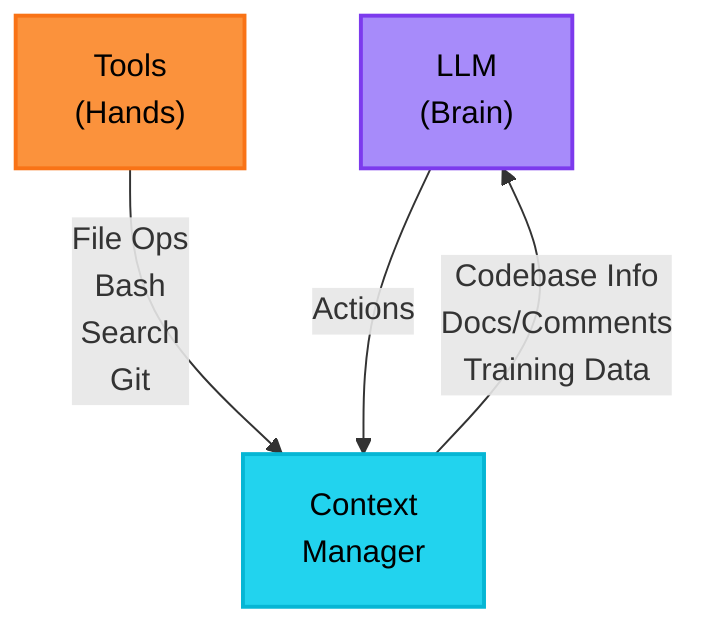
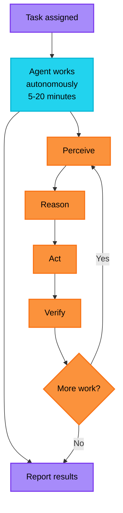
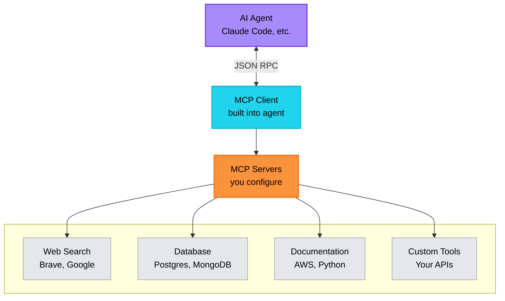

# How AI Coding Agents Work

AI coding agents in the CLI can read your entire codebase, plan multi-file changes, run tests, and fix bugs autonomously. But they're not magic—they're LLMs connected to tools, operating in loops with specific constraints. This lesson breaks down how they actually work: the architecture, the execution loop, the tools they use, and the limitations you need to understand to use them effectively.

## Learning Objectives

By the end of this lesson, you will:

- Understand how autonomous CLI agents work (LLM + Context + Tools)
- Recognize the agent execution loop: perceive, reason, act, verify, iterate
- See how tool execution enables agents to interact with codebases
- Identify architectural constraints that govern agent capabilities
- Understand how semantic code search extends agent comprehension
- Know when to use CLI agents versus manual coding

## The Core Architecture: Three Components

Every CLI agent—Claude Code, Aider, Cursor Composer—is built from the same three pieces:

**LLM + Context Manager + Tools**

Think of it like this:

- **LLM** (the brain): Reasons about what to do
- **Context Manager** (the memory): Knows what's relevant
- **Tools** (the hands): Actually does the work



### Component 1: The LLM (The Reasoning Engine)

**What it is:** A large language model trained on massive code repositories (GPT-4, Claude 3.5 Sonnet, Gemini, etc.)

**What it does:**

- Predicts what code should come next based on patterns
- Plans sequences of actions to accomplish a task
- Reasons about code structure and architecture
- Decides which tools to use and when

**Critical reality:** The LLM doesn't "understand" code the way you do. It's a statistical pattern matcher:

- **It generates valid syntax** because it learned patterns
- **It hallucinates APIs** when patterns seem familiar but aren't exact
- **It needs context** to make good predictions
- **It's probabilistic** - same input can produce different outputs

**Key constraint:** Context windows (8K-200K tokens) limit how much code it can "see" at once. You can't dump your entire codebase into memory.

### Component 2: Context Management (Finding What Matters)

**The problem:** Your codebase has thousands of files. The LLM can only "see" a fraction at once.

**The solution:** Smart context assembly - the agent searches, reads, and assembles just what's needed.

**What gets loaded into context:**

1. **Your prompt** - What you want done
2. **Relevant code** - Files, functions, classes that matter for this task
3. **Documentation** - READMEs, architecture docs, comments
4. **Examples** - Similar patterns from your codebase
5. **System instructions** - Rules for how the agent should behave

**How CLI agents build context:**

CLI agents have full filesystem access and search tools, so they find what they need iteratively:

1. **File system operations** - Read any file directly
2. **Search tools** - Grep for patterns, glob for file names, semantic search for concepts
3. **External resources** - Fetch docs, API specs, web search
4. **Iterative discovery** - Read → discover references → search for them → read more

**Example: You ask to "add rate limiting"**

```
Agent process:
1. Searches for "middleware" → finds auth middleware pattern
2. Reads auth middleware → understands your middleware structure
3. Searches for "rate" → finds nothing (not implemented yet)
4. Reads app entry point → sees where middleware is registered
5. Now has enough context to implement rate limiting your way
```

**Why this matters:** The agent doesn't just dump random files into context. It explores your codebase like you would—searching, reading, connecting the dots—to build understanding before coding.

### Component 3: Tools (How Agents Take Action)

**The key insight:** The LLM can't actually _do_ anything. It can only _decide_ what to do. Tools execute the actual work.

**Common tools available to CLI agents:**

| Tool Type           | What It Does               | Examples                         |
| ------------------- | -------------------------- | -------------------------------- |
| **File Operations** | Read and modify code       | `Read`, `Write`, `Edit`          |
| **Search**          | Find code in codebase      | `Grep`, `Glob`, semantic search  |
| **Shell Commands**  | Run anything you could run | `Bash`, `npm test`, `git diff`   |
| **Version Control** | Git operations             | `git commit`, `git branch`       |
| **Web Access**      | Fetch external info        | Documentation lookup, web search |

**How the tool loop works:**

```
You: "Add rate limiting to the API"

Agent thinking → Tool use → Feedback → Agent thinking → Tool use → ...

1. LLM: "I need to see the middleware structure"
   → Calls: Read tool on src/middleware/auth.ts
   → Gets back: [file contents]

2. LLM: "Now I understand the pattern, let me create rate limiting"
   → Calls: Write tool to create src/middleware/rateLimit.ts
   → Gets back: File written successfully

3. LLM: "Need to register this middleware"
   → Calls: Edit tool on src/app.ts
   → Gets back: Edit successful

4. LLM: "Let me verify it works"
   → Calls: Bash tool to run "npm test"
   → Gets back: 2 tests failing

5. LLM: "Need to fix the status code"
   → Calls: Edit tool to fix the middleware
   → Gets back: Edit successful

6. LLM: "Verify again"
   → Calls: Bash to run "npm test"
   → Gets back: All tests passing

Done.
```

**This is the fundamental loop:** Reason → Act (via tool) → Observe result → Repeat

## The Agent Execution Loop

When you give a CLI agent a task, it doesn't just generate code in one shot. It operates in a loop, similar to how you'd tackle a task yourself: explore, plan, code, test, fix, repeat.

**The five-phase loop:**



### 1. Perceive (Gather Information)

Agent explores the codebase to understand what's relevant:

- Searches for related code: `grep "middleware"`, `glob "**/auth*"`
- Reads discovered files
- Fetches external docs if needed (via web search or MCP)
- Builds mental model of architecture

### 2. Reason (Plan Approach)

Agent analyzes what it found and plans:

- Compares requirements to existing patterns
- Decides which files need changes
- Identifies dependencies and risks
- Plans sequence of actions

### 3. Act (Make Changes)

Agent executes the plan:

- Writes new files or edits existing ones
- Installs dependencies if needed
- Updates configs, docs, tests

### 4. Verify (Check If It Works)

Agent validates the changes:

- Runs test suite: `npm test`, `pytest`, etc.
- Checks compilation: `tsc`, `cargo build`
- Runs linters if configured
- Reads error output if something fails

### 5. Iterate (Fix and Improve)

If verification failed:

- Agent reads error messages
- Reasons about root cause
- Goes back to Act phase to fix
- Verifies again

If verification passed:

- Task complete → Report to human

### Concrete Example: "Add rate limiting to API endpoints"

```
You: "Add rate limiting to our Express API"

Agent starts autonomous execution:

[PERCEIVE]
→ grep "middleware" → finds auth middleware in src/middleware/auth.ts
→ Reads auth middleware → sees your pattern: export function, app.use()
→ glob "**/rate*" → nothing found, needs to be created
→ Reads src/app.ts → sees middleware registration pattern

[REASON]
→ "I'll follow the existing middleware pattern"
→ "Need to install express-rate-limit package"
→ "Should add tests following existing test structure"
→ Plan: Install dependency → Create middleware → Register it → Test

[ACT]
→ Runs: npm install express-rate-limit
→ Writes: src/middleware/rateLimit.ts (following auth.ts pattern)
→ Edits: src/app.ts (adds app.use(rateLimit))
→ Writes: tests/middleware/rateLimit.test.ts

[VERIFY]
→ Runs: npm test
→ Output: 2 failures - "Expected status 429, got 500"

[ITERATE - Back to PERCEIVE]
→ Reads test output - status code is wrong
→ Reads src/middleware/rateLimit.ts - finds the bug

[ACT again]
→ Edits: src/middleware/rateLimit.ts (fixes status code)

[VERIFY again]
→ Runs: npm test
→ Output: All tests passing ✓

[REPORT]
"Rate limiting implemented:
- Added express-rate-limit middleware
- Configured for 100 requests/15min per IP
- All tests passing
- Follows existing middleware patterns"
```

**This took the agent ~8 minutes. You saved ~45 minutes of implementation time.**

### What Makes This Powerful

**Self-correction:** Tests provide objective feedback. Agent sees failures and fixes them—just like you would.

**Full codebase understanding:** Agent searches and reads across your entire project, not just one file.

**Pattern matching:** Agent finds your existing patterns (middleware structure, test organization) and follows them.

**Multi-file operations:** One task can span creating files, editing configs, updating tests—all coordinated.

### What to Watch For

**Can go off track:** Agent might misunderstand requirements and head the wrong direction. Check in periodically.

**Context limits:** Really large refactorings might exceed the context window. Break into smaller tasks.

**Non-deterministic:** Run the same task twice, might get slightly different implementations. Both could be valid.

**Time investment:** 5-20 minute execution windows. Worth it for complex tasks, overkill for simple ones.

## Model Context Protocol (MCP): Extending Agent Capabilities

Agents are powerful when working with your codebase, but what about everything _outside_ your codebase? That's where MCP comes in.

**The problem:**

- Agent's knowledge is frozen at training time (often 6-12 months old)
- Can't access your company's internal tools
- Can't fetch current documentation or API specs
- Limited to what's in your local codebase

**The solution: MCP (Model Context Protocol)**

A standardized way for agents to connect to external tools and data sources—web search, databases, documentation APIs, company tools, anything you need.

### How MCP Works

Think of MCP as a plugin system for agents:



**What MCP enables:**

- **Tool discovery** - Agent can see what tools are available
- **Standardized API** - All MCP tools have the same interface
- **Resource access** - Databases, APIs, documentation, anything with an MCP server
- **Custom integration** - Build your own MCP servers for company-specific tools

### Concrete Example: OAuth Implementation

```
You: "Implement OAuth2 with PKCE flow for our GitHub integration"

WITHOUT MCP:
  Agent relies on training data (which might be from 2023)
  Might use outdated OAuth patterns
  Guesses at current GitHub API structure

WITH MCP:
  [Agent uses web-search MCP server]
  → "OAuth2 PKCE flow 2025 best practices"
  → Gets current security recommendations

  [Agent uses documentation MCP server]
  → Fetches latest GitHub OAuth2 API docs
  → Sees current endpoints, parameters, response formats

  [Agent implements using CURRENT information]
  → Code follows 2025 best practices
  → Uses correct GitHub API v3 patterns
  → Includes proper error handling for new edge cases
```

### Common MCP Servers You Might Use

**Development:**

- **Web search** - Brave Search, DuckDuckGo (find current best practices)
- **Documentation** - Python docs, AWS docs, MDN (fetch API references)
- **Code search** - Semantic codebase search (ChunkHound, Sourcegraph)

**Data access:**

- **Databases** - Postgres, MongoDB, Redis (inspect schemas, run queries)
- **APIs** - REST/GraphQL clients (test endpoints, fetch data)

**Company tools:**

- **GitHub** - Access PRs, issues, discussions
- **Slack** - Check team conventions documented in channels
- **Jira** - Look up requirements, acceptance criteria
- **Internal APIs** - Your custom tools and services

### Why This Matters for CLI Agents

CLI agents already have full filesystem and shell access—powerful but limited to your local environment. MCP extends their reach to:

1. **Current information** - Training data ages, MCP fetches fresh docs
2. **External context** - Reference designs, similar implementations elsewhere
3. **Company knowledge** - Internal wikis, design systems, API catalogs
4. **Validation** - Check implementations against live API schemas

**MCP adoption:** Native in Claude Code, supported by Cursor, growing ecosystem of community servers.

**Bottom line:** MCP turns agents from "smart autocomplete" into "connected research assistants" that can access the same resources you would when solving a problem.

## Architectural Constraints: What Agents Can't Do

CLI agents are powerful, but they have fundamental limitations. Understanding these helps you work _with_ them effectively instead of fighting against their nature.

### Constraint 1: Context Windows Are Finite

**The reality:** LLMs can only process 32K-200K tokens per request. A large codebase can be millions.

**What this means:**

- Agent can't load your entire codebase into memory at once
- Context "fills up" during long conversations (each message adds tokens)
- Large refactorings might hit the limit mid-task

**How to work with it:**

- Break big tasks into smaller chunks: "Refactor auth" → "Refactor auth/middleware" + "Refactor auth/validation"
- Agents use search to find relevant files instead of loading everything
- Semantic search helps agents find what matters without brute-forcing

### Constraint 2: No Persistent Memory

**The reality:** Each conversation starts fresh. Agent forgets everything from previous sessions.

**What this means:**

- Agent doesn't remember last week's conversation
- Doesn't learn from past mistakes across sessions
- You need to re-explain architecture decisions each time

**How to work with it:**

- **Use CLAUDE.md or similar files** - Agent loads these at session start, giving it persistent "memory"
- Document architectural decisions in your codebase (ADRs, README)
- Some agents cache prompts to reduce cost, but memory is still stateless

**Example:**

```
# CLAUDE.md in your repo
We use Redux for state management, not Context API.
Database queries go through the Repository pattern.
All API endpoints require JWT authentication.
```

Agent reads this every session → follows your conventions automatically.

### Constraint 3: Can't See Everything at Once

**The reality:** Even though CLI agents have filesystem access, they must explicitly search and read files. They don't have a holistic view by default.

**What this means:**

- Might miss relevant code in another module
- Could duplicate functionality that already exists elsewhere
- Depends on search quality to find the right files

**How to work with it:**

- Good naming conventions help agents find code via grep/glob
- Semantic search (covered next) finds code by meaning, not just filenames
- Tell agent where to look if you know: "Check src/utils for existing validation logic"

### Constraint 4: Probabilistic, Not Deterministic

**The reality:** LLMs sample from probability distributions. Same input can produce different outputs.

**What this means:**

- Run the same task twice → might get two different valid implementations
- Might hallucinate APIs that sound plausible but don't exist
- Can't guarantee a specific approach will be chosen

**How to work with it:**

- **Tests are critical** - They provide objective feedback that corrects hallucinations
- **Type checking helps** - Compiler catches non-existent APIs
- **Review agent output** - Don't blindly accept, especially for critical code
- Iteration is normal - agent tries, tests fail, agent fixes. This is the design, not a bug.

## Semantic Code Search: Finding Code by Meaning

Traditional search finds exact text matches. Semantic search finds code by _what it does_.

**The problem with grep:**

```bash
grep "authentication"
# Finds: Files with the word "authentication"
# Misses: login(), auth(), verifyUser(), validateToken()
# All related, but different words
```

**Semantic search solves this:**

```bash
semantic_search "user authentication logic"
# Finds: login(), authenticateUser(), verifyToken(), JWTMiddleware
# All conceptually similar, even with different names
```

### How It Works (Simplified)

**1. Index phase (run once):**
Your codebase gets converted into a searchable database:

```
Code files → Parse into functions/classes → Convert to vectors → Store in database

Example:
function validateEmail(email: string) { ... }
  ↓
[0.23, 0.91, -0.15, ..., 0.44]  // 1536-dimensional vector
  ↓
Stored with metadata: file path, function name, line number
```

**2. Search phase (when agent searches):**

```
Agent query: "email validation"
  ↓
Convert to same vector format
  ↓
Find vectors with highest similarity (cosine distance)
  ↓
Return matching code chunks, ranked by relevance
```

**The key insight:** Code that does similar things produces similar vectors, even if the words are completely different.

### Why This Matters for CLI Agents

**Scenario: "Add phone validation similar to email"**

**With grep (traditional search):**

```bash
$ grep -r "email" src/
# Returns 847 matches:
# - Variable names: userEmail, emailList, sendEmail
# - Comments: "// Send email notification"
# - Validation logic: validateEmail() ← what you actually want
# Agent drowns in noise, might miss the relevant pattern
```

**With semantic search:**

```bash
$ semantic_search "email validation implementation"

Results (ranked by relevance):
1. validateEmail() function (src/validation/email.ts:12)
2. Input sanitization docs (docs/validation.md)
3. Email validation tests (tests/validation.test.ts:45)
4. Base validation utility (src/utils/sanitize.ts:8)

Agent instantly sees:
- How you implement validation
- Your architectural pattern for input sanitization
- Edge cases you care about (from tests)
- Shared utilities to reuse
```

**Agent can now build phone validation that:**

- Follows your existing pattern
- Reuses shared sanitization logic
- Handles edge cases consistently
- Matches your code style

### Multi-Hop Discovery

Agents can chain semantic searches to build architectural understanding:

```
Task: "Improve auth security"

[Search 1] "user authentication"
  → Finds: login(), JWTMiddleware, tokenGeneration()

[Agent reads code, sees "refresh token" mentioned]

[Search 2] "refresh token implementation"
  → Finds: refreshToken(), security docs, Redis cache config

[Agent reads docs, sees "rate limiting" requirement]

[Search 3] "rate limiting authentication"
  → Finds: rateLimitMiddleware(), existing patterns

Result: Agent now understands your complete auth architecture
        across multiple modules, without you explaining anything
```

### Cross-Format Search

Semantic search works across code, docs, tests, and comments:

- **"How does caching work?"** → Finds implementation + architecture docs
- **"What are our API design principles?"** → Finds READMEs + example implementations
- **"Error handling patterns"** → Finds try-catch blocks + error middleware + docs
- **"Database schema for users"** → Finds models + migrations + SQL comments

### Practical Impact

**Without semantic search:**

- Agent relies on guessing filenames or exact keyword matches
- Might miss relevant code in another module
- Can't connect code to documentation
- May duplicate functionality that exists with a different name

**With semantic search:**

- Find code by _what it does_, not what it's called
- Discover patterns across your entire codebase
- Connect implementation to design decisions
- Avoid reinventing wheels

**Tools available:**

- **ChunkHound** - MCP server, runs locally, open-source
- **Cursor** - Built-in codebase indexing
- **Sourcegraph Cody** - Enterprise solution
- **Custom** - Build your own with vector databases

**Bottom line:** Semantic search turns agents from "smart greppers" into "architecture explorers" that understand your codebase holistically.

## When to Use CLI Agents

CLI agents are powerful but not always the right tool. Here's when they shine versus when manual coding is better:

**Use CLI agents for:**

| Task Type                      | Why Agents Excel                           | Example                                                     |
| ------------------------------ | ------------------------------------------ | ----------------------------------------------------------- |
| **Multi-file refactoring**     | Agents can coordinate changes across files | "Rename UserService to AccountService across the codebase"  |
| **Boilerplate implementation** | Following existing patterns at scale       | "Add CRUD endpoints for Product model like we did for User" |
| **Test generation**            | Writing comprehensive test coverage        | "Generate tests for all auth middleware functions"          |
| **Bug fixing with context**    | Finding and fixing issues across modules   | "Fix the race condition in order processing"                |
| **Documentation sync**         | Updating docs to match code changes        | "Update API docs to reflect new authentication flow"        |
| **Dependency updates**         | Handling breaking changes systematically   | "Upgrade React Router v5 to v6 and fix all usages"          |

**Use manual coding for:**

| Task Type                  | Why Manual is Better                    | Example                                          |
| -------------------------- | --------------------------------------- | ------------------------------------------------ |
| **Novel algorithms**       | Agent can't invent truly new approaches | Designing a custom conflict resolution algorithm |
| **Critical security**      | Too important to delegate               | Implementing cryptographic functions             |
| **Single-file tweaks**     | Faster to just do it                    | Changing one constant value                      |
| **Ambiguous requirements** | Needs human judgment                    | "Make the UX better"                             |
| **Learning new patterns**  | You need to understand it deeply        | Implementing your first GraphQL resolver         |

**The 5-minute rule:**

- If explaining the task to an agent takes longer than doing it yourself: **do it manually**
- If the task would take you 30+ minutes but agent can do it in 5: **use agent**
- If you're not sure what "done" looks like: **do it manually first, then teach agent the pattern**

## Key Takeaways

**The Core Architecture:**

1. **Every CLI agent = LLM + Context Manager + Tools**
   - LLM reasons and plans
   - Context manager finds relevant information
   - Tools execute actual work (file ops, bash, git, etc.)

2. **LLMs are pattern matchers, not magic**
   - They predict probable tokens based on training data
   - They hallucinate when patterns seem familiar but aren't exact
   - They're probabilistic—same input can produce different outputs
   - Tests and types catch hallucinations; this is by design

**The Agent Loop:**

1. **Perceive** → Search/read codebase to understand what's relevant
2. **Reason** → Plan approach based on findings
3. **Act** → Write/edit code, install dependencies
4. **Verify** → Run tests, check compilation
5. **Iterate** → Fix failures and repeat until done

This loop is what makes agents powerful—they self-correct based on objective feedback.

**Context Matters:**

1. **Context windows are finite** (32K-200K tokens)
   - Can't load entire codebase at once
   - Break large tasks into smaller chunks
   - Agents use search to find what matters

2. **No persistent memory**
   - Each session starts fresh
   - Use CLAUDE.md or similar files for "persistent memory"
   - Document architectural decisions in your codebase

**Tools That Extend Agents:**

1. **MCP (Model Context Protocol)** - Connect agents to external resources
   - Web search for current best practices
   - Documentation APIs for up-to-date references
   - Company tools (GitHub, Slack, internal APIs)
   - Turns agents from "codebase explorers" into "connected researchers"

2. **Semantic Search** - Find code by meaning, not exact text
   - Discover patterns across your codebase
   - Connect code to docs to tests
   - Avoid duplicating existing functionality
   - Agent understands architecture holistically

**When to Use CLI Agents:**

- **Good for:** Multi-file refactoring, boilerplate implementation, test generation, bug fixes requiring context
- **Bad for:** Novel algorithms, critical security code, single-file tweaks, ambiguous requirements
- **Rule of thumb:** If explaining takes longer than doing, just code it yourself

**The Bottom Line:**
CLI agents aren't magic—they're LLMs with access to tools, operating in iterative loops with specific constraints. Understanding how they actually work lets you use them effectively: provide good context, break down large tasks, verify with tests, and work with their probabilistic nature instead of against it.

---

**Next:** [Lesson 3: The Four Operating Principles](./lesson-3-operating-principles.md) - Master the fundamental constraints that govern successful agent operation
